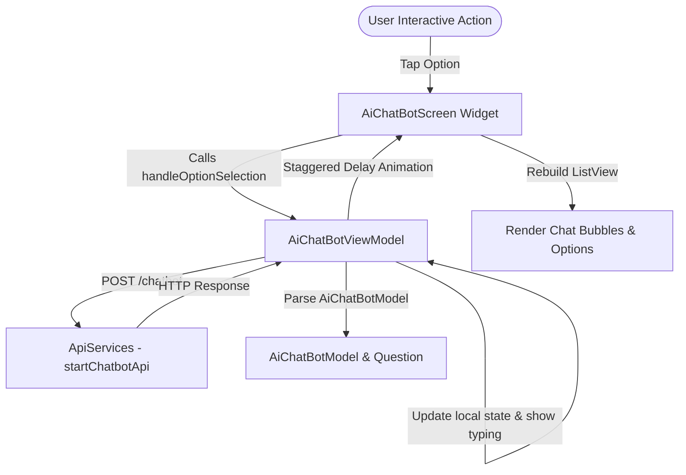

# AI ChatBot Architecture & Execution Flow Documentation

This document provides a comprehensive breakdown of the AI ChatBot feature in the Neow application, detailing its architectural flow, data models, state management, API interactions, and UI widget hierarchy.

---

## 1. Architectural Overview

The AI ChatBot module is built using the **MVVM (Model-View-ViewModel)** architectural pattern with Flutter's `Provider` package for state management. It delivers an interactive, dynamic, Q&A-driven conversation experience tailored to user period cycle logs and health data.



---

## 2. Directory Structure

All files related to the AI ChatBot are localized in `lib/ui/naveli_ui/ai_chatbot/`:

```text
lib/ui/naveli_ui/ai_chatbot/
├── model/
│   └── ai_chatbot_model.dart        # Data classes for API serialization
├── viewModel/
│   └── ai_chatbot_viewmodel.dart    # Business logic, API calls, state management
├── views/
│   └── ai_chatbot_screen.dart       # Main screen & message bubble builders
└── widgets/
    ├── custom_image_loader.dart     # Single and multi-image carousel widget
    ├── custom_option_button.dart    # Single option button widget
    ├── custom_option_multi_button.dart # Multiple choice option button widget
    ├── full_screen_image.dart       # Full-screen zoomable image viewer
    └── typing_indicator.dart        # Animated 3-dot typing indicator
```

---

## 3. Data Models (`ai_chatbot_model.dart`)

The data model parses responses from the `/chatbot` endpoint.

### Key Classes:
* **`AiChatBotModel`**: Root response object containing:
  * `questions`: List of `Question` items to display.
  * `logDay`, `botPhase`, `message`: Cycle phase context.
  * `ovulationDay`, `preovulationDay`, `fertileWindowStart`, `fertileWindowEnd`, `periodStartDate`, `periodEndDate`: Health metadata.
* **`Question`**: Represents a single bot message or query:
  * `id`: Unique question identifier.
  * `text`: The string prompt/message from the bot.
  * `isInformational`: Flag indicating whether user response is required (`0` or `1`).
  * `options`: List of available `Option` objects.
  * `userAnswer`: Holds the user's selected response text after selection.
  * `imagePath`: Optional network image or multi-image comma-separated URLs attached to the question.
* **`Option`**: Selectable user response:
  * `id`: Option identifier sent back to the API.
  * `text`: Option label text displayed on buttons.
  * `isSelected`: Local UI boolean state for highlighting selection.

---

## 4. State Management (`AiChatBotViewModel`)

`AiChatBotViewModel` (extending `ChangeNotifier`) manages the state of the conversation trajectory.

### Primary Responsibilities:
1. **`fetchChatBotData({myParams, isStarting})`**:
   * Initiates POST calls to `ApiUrl.startChatbot` via `Services().api!.startChatbotApi()`.
   * When `isStarting: true`, resets message history and visible indices.
   * Parses incoming questions and appends them to `_chatMessages`.
   * Triggers `showMessagesWithDelay()` to create a natural, conversational pacing.
2. **`handleOptionSelection(Option option)`**:
   * Highlights selected option and sets `userAnswer` on the last question.
   * Displays the animated `TypingIndicator`.
   * Prepares payload with `question_id` and selected `answer` ID.
   * Calls `fetchChatBotData()` asynchronously to fetch the next bot response.
3. **`showMessagesWithDelay()`**:
   * Simulates realistic human/AI typing speed by introducing 2-second typing delays before revealing each new question index in `_visibleIndexes`.

---

## 5. UI Screen Widget Breakdown (`AiChatBotScreen`)

The main interface is implemented in `AiChatBotScreen` (`ai_chatbot_screen.dart`).

### Key Features & Components:
* **Auto-Scrolling (`ScrollController`)**: Listens to changes in `visibleIndexes` and smoothly auto-scrolls to the bottom of the chat view when new messages or typing indicators appear.
* **ListView Builder**: Rendered using `ListView.builder`, rendering visible items based on `viewModel.visibleIndexes`.
* **Dynamic Options Bar**: Rendered at the bottom of the screen when `viewModel.isLastQuestionVisible` is true:
  * Uses `CustomOptionButton` if there is a single choice.
  * Uses `CustomOptionMultiButton` wrapped in a `Wrap` widget if multiple options exist.

### Message Bubble Helper (`customMessage`):
Renders message bubbles depending on content type:
* **Bot Question**: Left-aligned grey container (`CommonColors.bgGrey`).
* **User Answer**: Right-aligned purple pill container (`CommonColors.primaryColor`).
* **Bot Image Attachment**: Displays `CustomImageLoader` inside the bubble.

---

## 6. Widget Reference & Descriptions

| Widget | File Location | Purpose & Description |
| :--- | :--- | :--- |
| **`AiChatBotScreen`** | `views/ai_chatbot_screen.dart` | Main screen scaffold displaying the chat app bar, scrollable message list, typing indicator, and bottom options bar. |
| **`CustomOptionButton`** | `widgets/custom_option_button.dart` | Full-width or prominent single option button for quick replies. |
| **`CustomOptionMultiButton`** | `widgets/custom_option_multi_button.dart` | Compact chip-style button used when multiple selectable options are presented to the user. |
| **`TypingIndicator`** | `widgets/typing_indicator.dart` | Stateful animated 3-dot jumping indicator that plays while waiting for AI responses. |
| **`CustomImageLoader`** | `widgets/custom_image_loader.dart` | Smart image renderer supporting single network images and comma-separated multi-image carousels with progress indicators. |
| **`FullscreenImage`** | `widgets/full_screen_image.dart` | Interactive zoomable full-screen image viewer opened when tapping images in chat. |

---

## 7. API Integration Sequence

### Endpoint Details:
* **URL**: `POST` `https://lab1.invoidea.work/neow/public/api/chatbot` (`ApiUrl.startChatbot`)
* **Headers**: `Content-Type: application/json`, `Authorization: Bearer <TOKEN>`

### Initial Payload (Conversation Start):
```json
{
  "answers": [],
  "language": "en"
}
```

### Response Payload Example:
```json
{
  "log_day": 14,
  "bot_phase": "ovulation",
  "questions": [
    {
      "id": 102,
      "text": "How are you feeling today?",
      "is_informational": 0,
      "image_path": null,
      "options": [
        { "id": 1, "text": "Energetic" },
        { "id": 2, "text": "Tired" }
      ]
    }
  ]
}
```

### Subsequent Payload (User Response):
```json
{
  "answers": [
    {
      "question_id": 102,
      "answer": 1
    }
  ],
  "language": "en"
}
```
