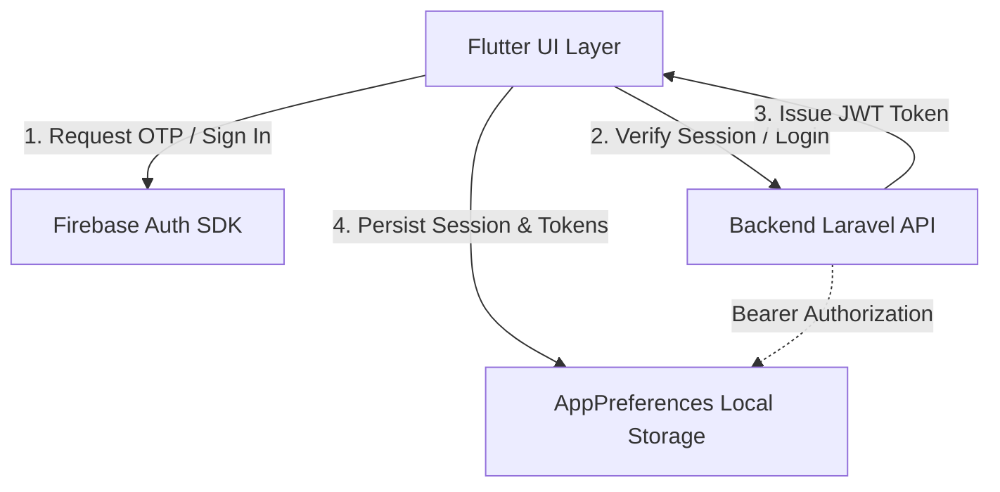
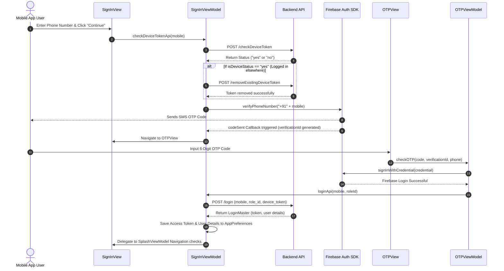
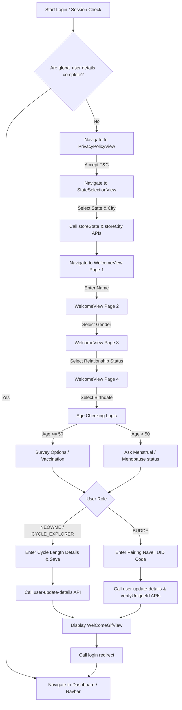
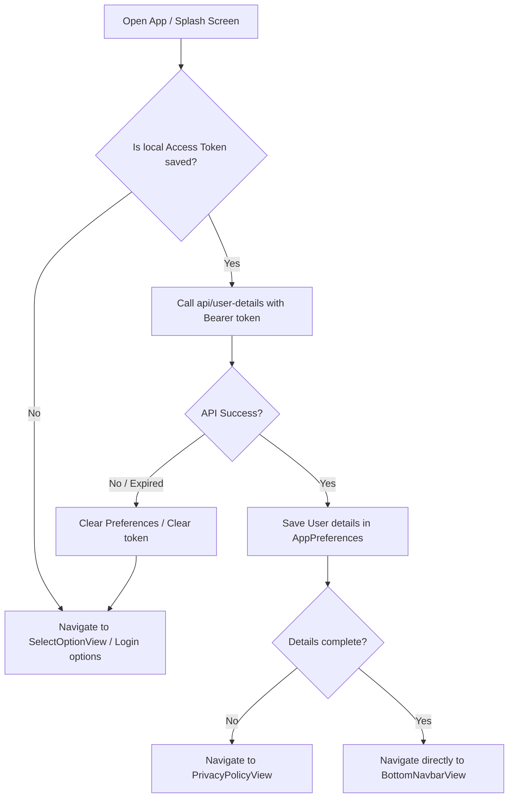

# Authentication and Onboarding Flow Documentation

This document explains the authentication, onboarding, and session management flows of the **Neow** application. The system implements a hybrid authentication model using **Firebase Phone Auth** for SMS OTP verification and a **Custom Laravel-based Backend API** for role-based sessions and JWT access tokens.

---

## 1. Auth Flow Architecture Overview

The authentication structure comprises:
- **Firebase Auth (Client SDK)**: Sends SMS OTPs to the mobile number and validates the code to retrieve standard credentials.
- **Custom App API Service (`ApiServices`)**: Validates device tokens, manages backend user sessions, performs onboarding parameter updates, and registers/signs out users.
- **Local Storage (`AppPreferences`)**: Persists the JWT access token, FCM device token, user demographic preferences, and onboarding progress states.



---

## 2. API Endpoints Reference

The following endpoints defined in `ApiUrl` (`lib/services/api_url.dart`) govern authentication, session security, and profile onboarding states:

| Endpoint | HTTP Method | Request Body / Params | Authorization Header | Description |
| :--- | :--- | :--- | :--- | :--- |
| `api/signup` | `POST` | `role_id`, `email`, `mobile`, `password` | None | Registers a new user. |
| `api/checkDeviceToken` | `POST` | `mobile` | None | Checks if the user's mobile number has an active session on another device. |
| `api/removeExistingDeviceToken`| `POST` | `mobile` | None | Deauthorizes current FCM device token mapped to this mobile number. |
| `api/login` | `POST` | `mobile`, `role_id`, `device_token` | None | Authenticates with the backend, records FCM token, and returns a JWT access token. |
| `api/user-details` | `GET` | None | `Bearer <JWT>` | Retrieves the current user's profile metadata and syncs local state. |
| `api/storeState` | `POST` | `state_id` | `Bearer <JWT>` | Associates the user's account with a state. |
| `api/storeCity` | `POST` | `city_id` | `Bearer <JWT>` | Associates the user's account with a city. |
| `api/user-update-details` | `POST` | `role_id`, `name`, `birthdate`, `gender`, `gender_type`, `relationship_status`, `average_cycle_length`, `previous_periods_begin`, etc. | `Bearer <JWT>` | Saves onboarding questionnaire progress and profile variables. |
| `api/logout` | `GET` | None | `Bearer <JWT>` | Invalidates user JWT token on the backend server. |
| `api/change-status` | `POST` | None | `Bearer <JWT>` | Deactivates/deletes user account. |

---

## 3. Core Walkthrough Flows

### A. Sign-In & Verification Sequence
The sign-in flow uses the user's 10-digit mobile number. The flow ensures device session management (checking for login on other devices) before sending a Firebase SMS OTP.



---

### B. Onboarding & Profile Setup Flow Chart
When a user logs in, the app checks if their profile metadata is complete. If incomplete, it routes them through a series of onboarding steps:



---

### C. Splash View / App Startup Validation
When the user opens the app, the session check resolves navigation routes based on the token presence and session validity:



---

## 4. Technical Implementation Notes

### Access Token Injection
Authenticated endpoints use `AppBaseClient.postApiWithTokenCall()` or `AppBaseClient.getApiWithTokenCall()`. The access token is injected dynamically:
```dart
String accessToken = AppPreferences.instance.getAccessToken();
// Injected into HTTP request header:
headers: {
  "Content-Type": "application/json",
  "Authorization": "Bearer $accessToken",
}
```

### Logout and Local Cleanup
When a user logs out (`logoutApi` in `SplashViewModel`), the app issues a request to the backend `/logout` endpoint to invalidate the session token on the server. Following this, the application executes `clearPreference()`, which clears all cached states while retaining the base language code and device push token:
```dart
Future<void> clearPreference() async {
  mainNavKey.currentContext!.read<BottomNavbarViewModel>().selectedIndex = 0;
  String fCMToken = AppPreferences.instance.getFCMToken();
  String langCode = AppPreferences.instance.getLanguageCode();
  await AppPreferences.instance.clear();
  await AppPreferences.instance.setIsFirstTime(false);
  await AppPreferences.instance.setLanguageCode(langCode);
  await AppPreferences.instance.setFCMToken(fCMToken);
  globalUserMaster = null;
  gUserType = "";
  pushAndRemoveUntil(const SelectOptionView());
}
```
