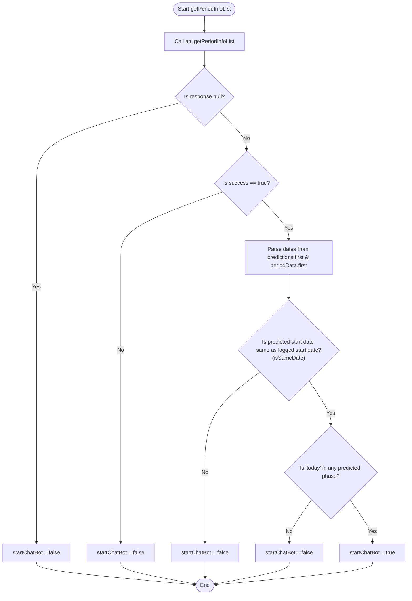

# Start ChatBot Activation Guide

This document explains the logic used to determine whether the AI ChatBot feature (`startChatBot`) is enabled (`true`) or disabled (`false`).

---

## 1. Logical Flowchart

The following flowchart shows the step-by-step validation of dates and status flags:



### Condition A Breakdown (Is "today" in any predicted phase?)
`today` must fall into **at least one** of these categories (inclusive of start and end dates):
1. **Predicted Period:** Between `periodStartdateTime` and `periodEnddateTime`.
2. **Predicted Fertile Window:** Between `fertileStartDateTime` and `fertileEndDateTime`.
3. **Predicted Ovulation Day:** Same day/moment as `ovulationDateTime`.

---

## 2. Source Code Reference

You can match this logic directly with the following code sections:

### Variables & Core Logic
Located in [home_view_model.dart](file:///c:/Users/Gaurav/Documents/Gaurav-work/Neow/lib/ui/naveli_ui/home/home_view_model.dart#L578-L590):
```dart
      if ((isWithin(periodStartdateTime, periodEnddateTime, today) ||
              isWithinNoTime(periodStartdateTime, periodEnddateTime, today) ||
              isWithin(fertileStartDateTime, fertileEndDateTime, today) ||
              isWithinNoTime(fertileStartDateTime, fertileEndDateTime, today) ||
              today.isAtSameMomentAs(ovulationDateTime ?? oldDateTime)) &&
          (isSameDate(periodStartdateTime, periodStartLogDateTime))) {
        startChatBot = true;
        notifyListeners();
      } else {
        startChatBot = false;
        notifyListeners();
      }
```

### Date Helper Functions
Located in [home_view_model.dart](file:///c:/Users/Gaurav/Documents/Gaurav-work/Neow/lib/ui/naveli_ui/home/home_view_model.dart#L611-L638):
```dart
  bool isWithin(DateTime? start, DateTime? end, DateTime? target) {
    if (start != null && end != null && target != null)
      return (target.isAtSameMomentAs(start) ||
          target.isAtSameMomentAs(end) ||
          (target.isAfter(start) && target.isBefore(end)));

    return false;
  }

  bool isWithinNoTime(DateTime? start, DateTime? end, DateTime? target) {
    if (start != null && end != null && target != null) {
      bool isSameDate(DateTime a, DateTime b) =>
          a.year == b.year && a.month == b.month && a.day == b.day;

      return (isSameDate(target, start) ||
          isSameDate(target, end) ||
          (target.isAfter(start) && target.isBefore(end)));
    }

    return false;
  }

  bool isSameDate(DateTime? a, DateTime? b) {
    if (a != null && b != null) {
      return a.year == b.year && a.month == b.month && a.day == b.day;
    } else
      return false;
  }
```

---

## 3. Example Walkthrough

Given your API response data:

### Input Values
```json
{
  "periods_info": [
    {
      "period_start_date": "2026-06-17",
      "period_end_date": "2026-06-21"
    }
  ],
  "predictions": [
    {
      "predicted_start": "2026-06-17",
      "predicted_end": "2026-06-21",
      "ovulation_day": "2026-07-01",
      "fertile_window_start": "2026-06-26",
      "fertile_window_end": "2026-07-03"
    }
  ]
}
```

### Trace Steps
1. **API check:** `success == true` $\rightarrow$ proceed.
2. **Assign variables:**
   - `periodStartLogDateTime` = `2026-06-17`
   - `periodStartdateTime` = `2026-06-17`
   - `periodEnddateTime` = `2026-06-21`
   - `fertileStartDateTime` = `2026-06-26`
   - `fertileEndDateTime` = `2026-07-03`
   - `ovulationDateTime` = `2026-07-01`
3. **Condition B:** `isSameDate(2026-06-17, 2026-06-17)` $\rightarrow$ **`TRUE`**.
4. **Condition A:** Checks if `today` is within:
   - June 17 – June 21 (predicted period) OR
   - June 26 – July 03 (predicted fertile window) OR
   - July 01 (predicted ovulation)
   
* **Result:** If `today` meets any of these date ranges, `startChatBot = true`. Otherwise, it evaluates to `false`.
