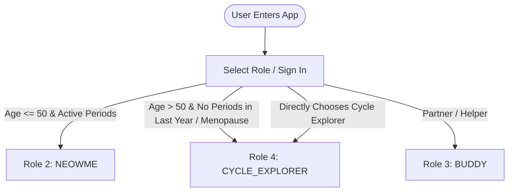
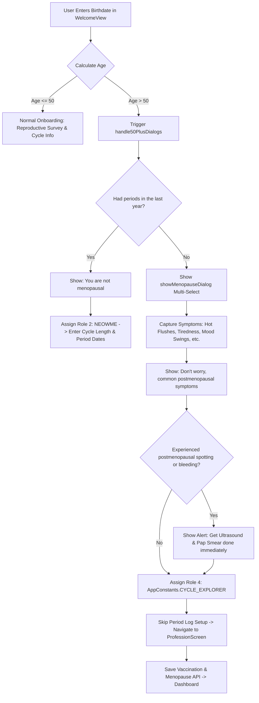
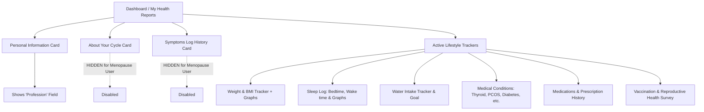

# NeoW Application: User Flows & Post-Login Scenarios Documentation

This document provides an exhaustive, code-level analysis of the **NeoW** mobile application architecture, navigation paths, user role segmentation, and distinct post-login user experiences—with a dedicated deep-dive into the **Menopausal / Cycle Explorer** flow.

---

## 1. User Roles & Account Classification

The application defines three distinct user types governed by `AppConstants` (`lib/utils/constant.dart`) and backend `role_id`s:

| Role Constant | Role ID | Target Audience | Primary Focus |
| :--- | :---: | :--- | :--- |
| **`AppConstants.NEOWME`** | `2` | Women with active menstrual cycles | Cycle tracking, period predictions, fertile window, ovulation, symptom logging, personalized daily vibe. |
| **`AppConstants.BUDDY`** | `3` | Partners / Males / Companions | Companion monitoring of a linked NeoW user via unique pairing code (`uuId`). |
| **`AppConstants.CYCLE_EXPLORER`** | `4` | Menopausal women & users without active periods | Menopause wellness, health education videos, general lifestyle tracking (Sleep, Water, BMI, Ailments), community forum, and AI chatbot. |



---

## 2. Onboarding & Menopause Trigger Logic

During user onboarding in `WelcomeView` (`lib/ui/common_ui/welcome/welcome_view.dart`), the app executes dynamic branching based on age and menstrual status:



### Menopause Questionnaire & Symptoms Data Model
When a user is flagged as postmenopausal:
1. **Multi-Select Symptoms Dialog (`showMenopauseDialog`)**:
   - `1`: Hot Flushes
   - `2`: Tiredness
   - `3`: Mood Swings
   - `4`: Vaginal Dryness
   - `5`: Decreased Sex Drive
   - `6`: Joint Pain
2. **Postmenopausal Spotting Risk Dialog**:
   - If spotting/bleeding is reported, the app displays an urgent clinical recommendation: *"Get Ultrasound and Pap Smear done immediately"* citing possible medical risks.
3. **Automatic Reassignment**:
   - `roleId` is switched to `4` (`CYCLE_EXPLORER`).
   - Period date input pages (Average Cycle Length, Last Period Date, Period Duration) are bypassed.
   - User is routed to enter their **Profession** (`ProfessionScreen`) before entering the main app.

---

## 3. Post-Login Flow & Screen Options Matrix

The bottom navigation bar contains four fixed primary destinations (`BottomNavbarView`):
1. **Home (`HomeView`)**
2. **Health Mix (`HealthMixView`)**
3. **Forum (`ForumView`)**
4. **Profile (`ProfileView`)**

Below is a detailed comparison of available options across different user scenarios:

| Feature / UI Component | Scenario A: NeoW User (`NEOWME` - Role 2) | Scenario B: Menopause User (`CYCLE_EXPLORER` - Role 4) | Scenario C: Buddy User (`BUDDY` - Role 3) |
| :--- | :--- | :--- | :--- |
| **Top Bar Greeting** | `"Hi, NeoW <Name> !"` | `"Hi, NeoW <Name> !"` | `"Hi, Buddy <Name> !"` |
| **Notifications Icon** | Available (Bell Icon) | **Hidden** | **Hidden** |
| **Calendar Icon** | Available (Opens `CalendarView`) | **Hidden** | Available (Opens `CalendarView`) |
| **Horizontal Date Strip** | **Visible** (Week date carousel) | **Hidden** | **Visible** (Linked partner dates) |
| **Cycle Arc / Dial / Phase** | **Visible** (Current cycle day, phase color loader, "Period in X days") | **Hidden** (Replaced by Featured Health Video) | **Visible** (Displays linked partner cycle phase) |
| **"Log Period" Button** | **Visible** (Navigates to Calendar Log) | **Hidden** | **Hidden** (Buddy cannot log periods) |
| **Featured Video Player** | Hidden (or embedded in HealthMix) | **Visible** (Dedicated 250px YouTube player) | Hidden |
| **AI ChatBot Banner ("Chat Now")** | Visible in PageView carousel | **Hidden** (Only "The NeoW Story" banner shown) | Visible in PageView carousel |
| **"Track & Learn" Header** | **Visible** with "View All" link | **Hidden** | **Visible** with "View All" link |
| **Daily Insights Cards** | Horizontal scroll: `LogYourSymptoms`, `Articles`, `DeStress` | **2-Column Grid**: `Articles`, `DeStress` (*Log Symptoms omitted*) | Horizontal scroll: `Articles`, `DeStress` |
| **HealthMix Category Cards** | Visible (2x2 grid with "View All") | Visible (2x2 grid with "View All") | Visible (2x2 grid with "View All") |
| **Latest Videos & Shorts** | Visible (List + Shorts Reels button) | Visible (List + Shorts Reels button) | Visible (List + Shorts Reels button) |

---

## 4. Deep-Dive: Menopause User Experience (`CYCLE_EXPLORER`)

### A. Home Screen (`HomeView`)
When a logged-in woman has reached menopause:
* **No Top Bar Calendar Icon & Notifications**: The Calendar button and Notification bell are **hidden** in the top bar.
* **No Menstrual Warnings or Period Dials**: The app disables period calculations (`checkPeriodLog()`), removing cycle timers, late period popups, and fertile window alerts.
* **Educational Video Hero Widget**: At the top of the home screen, the period wheel is replaced with a full-width **Featured Health Video** (`VideoPlayerScreen`).
* **Promo Banner Carousel**: The "Chat Now" card is **hidden**; only "The NeoW Story" promo banner is presented without carousel indicators.
* **Daily Insights Grid**: Replaces the horizontal menstrual symptom slider with a balanced **2-Column Grid** offering:
  1. **Articles (`AllAboutPeriodsView` / Know Your Body)**: Explains hormonal changes, postmenopausal care, nutrition, bone density, and heart health.
  2. **De-Stress (`DeStressView`)**: Interactive stress management, meditation, and breathing techniques.
* **Health Mix & Videos**: Instant access to video library, health shorts, wellness blogs, and recipes.

---

### B. Health Reports & Dashboard (`DashboardView`)
Accessed via **Profile $\rightarrow$ My Health Reports**, the dashboard adapts specifically for menopause users:



1. **Top Bar Actions**: The *Download Symptoms Report* icon is **Hidden** (since menstrual cycle logs are not recorded).
2. **Personal Information**:
   - Displays Name, Email, DOB, Age Group, Relationship Status, State, and District.
   - Displays a dedicated editable **Profession** field.
3. **Excluded Cards**:
   - ❌ **About Your Cycle**: Cycle length, period duration, and last period date accordions are hidden.
   - ❌ **Symptoms**: Menstrual flow, period pain, and cycle-specific symptom charts are hidden.
4. **Active Lifestyle & Health Trackers**:
   - ✅ **Weight & BMI**: Weight history log, BMI score calculation, and health category.
   - ✅ **Sleep Log**: Daily bedtime, wakeup time, total hours slept, and graphical trends.
   - ✅ **Water Intake**: Daily hydration counter and reminder targets.
   - ✅ **Medical Conditions / Ailments**: Records of existing conditions (Diabetes, Hypertension, Thyroid, etc.).
   - ✅ **Medications**: Past and active medication courses.
   - ✅ **Vaccination & Reproductive Survey**: Cervical cancer / HPV vaccine history, Pap smear records, and postmenopausal symptom history, complete with a **Download Vaccination Report** button.

---

### C. Health Mix Section (`HealthMixView`)
* Filter wellness content by categories: Nutrition, Fitness, Mental Wellbeing, Holistic Care, and Healthy Living.
* Interactive search and bookmarking of health articles and expert video sessions.
* Dedicated **Shorts Feed** (`ShortsView`) for bite-sized health tips.

---

### D. Community Forum (`ForumView`)
* Browse posts, engage in discussions, like, and comment on health threads.
* Manage topic preferences via **Interests View (`InterestView`)** to curate feed content.
* Confidential and safe community interaction.

---

### E. Profile & Account Settings (`ProfileView` & `SettingsView`)
* **About Us**: Mission, vision, and core team behind NeoW.
* **Help & FAQs (`HelpView`)**: Common questions regarding app usage and health guidance.
* **App Settings (`SettingsView`)**:
  * Language toggle (English / Hindi).
  * Update Mobile Number and Email Address.
  * Privacy Policy & Terms of Service.
  * Account Management (Deactivate / Delete Account).
* **Rate & Share**: Rate on Play Store / App Store, or share with friends and family.

---

## 5. Summary Matrix of Post-Login Flows

```
┌──────────────────────────────────────────────────────────────────────────────────────────────────┐
│                                       USER LOGS IN TO NEOW                                       │
└──────────────────────────────────────────────────────────────────────────────────────────────────┘
                                                 │
                   ┌─────────────────────────────┼─────────────────────────────┐
                   ▼                             ▼                             ▼
       ┌───────────────────────┐   ┌───────────────────────────┐   ┌───────────────────────┐
       │   ROLE 2: NEOWME      │   │  ROLE 4: CYCLE EXPLORER   │   │    ROLE 3: BUDDY      │
       │  (Active Menstruation)│   │        (Menopause)        │   │   (Partner / Helper)  │
       └───────────────────────┘   └───────────────────────────┘   └───────────────────────┘
                   │                             │                             │
       ┌───────────┴───────────┐   ┌─────────────┴───────────┐     ┌───────────┴───────────┐
       │ • Period Dial / Cycle │   │ • Educational Video     │     │ • Linked User Status  │
       │ • Daily Vibe Check-in │   │ • 2-Col Insights Grid   │     │ • Partner Cycle Wheel │
       │ • "Log Period" Button │   │ • AI Chatbot Access     │     │ • Relation with NeoW  │
       │ • Log Symptoms Option │   │ • BMI, Sleep & Water    │     │ • Read-Only Tracking  │
       │ • Menstrual Reports   │   │ • Menopause Care Survey │     │ • Restricted Logging  │
       │ • Cycle Notifications │   │ • Forum & Health Mix    │     │ • Buddy Request Sync  │
       └───────────────────────┘   └─────────────────────────┘     └───────────────────────┘
```
